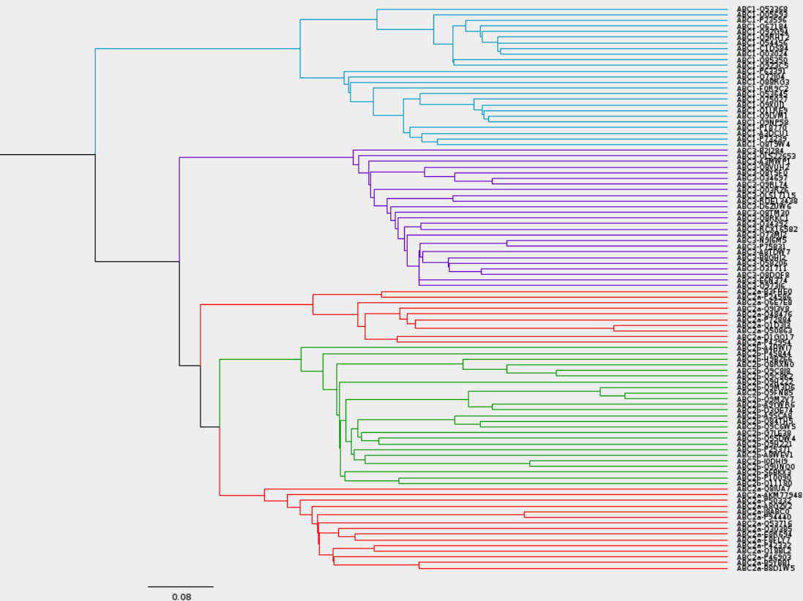
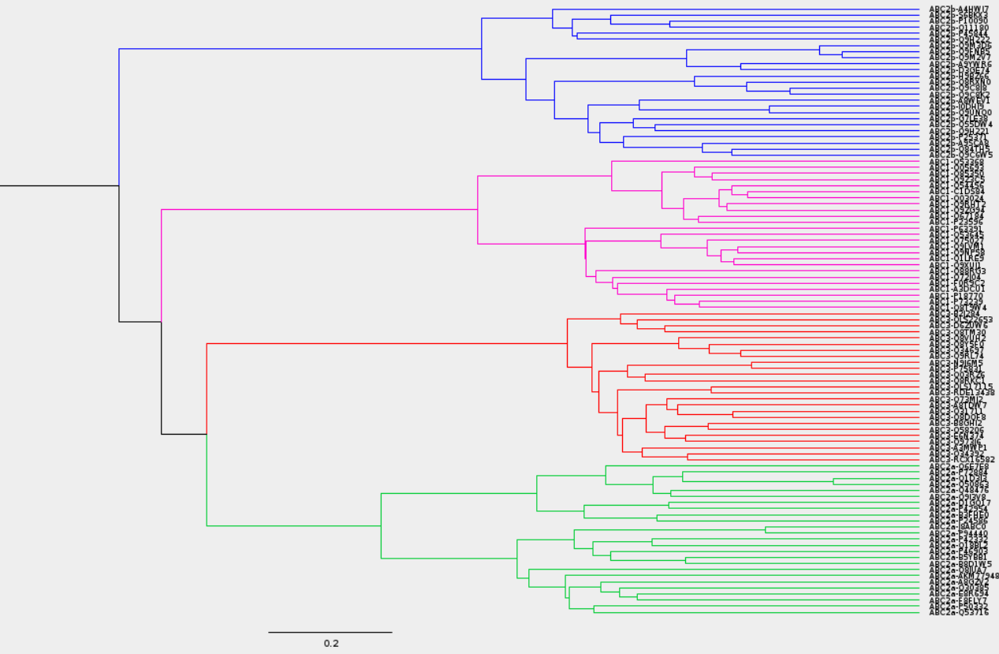
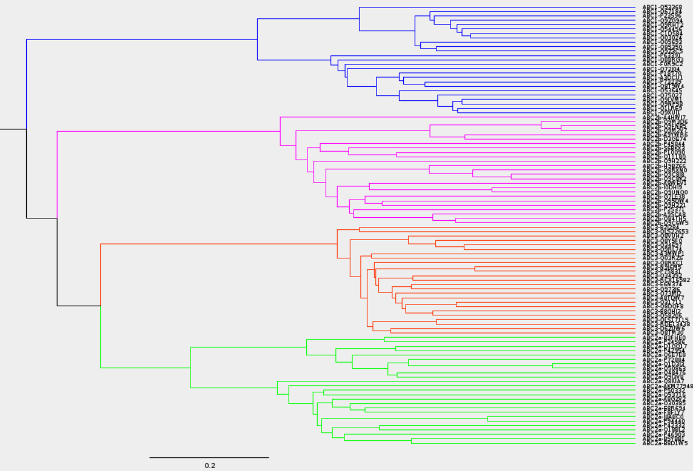
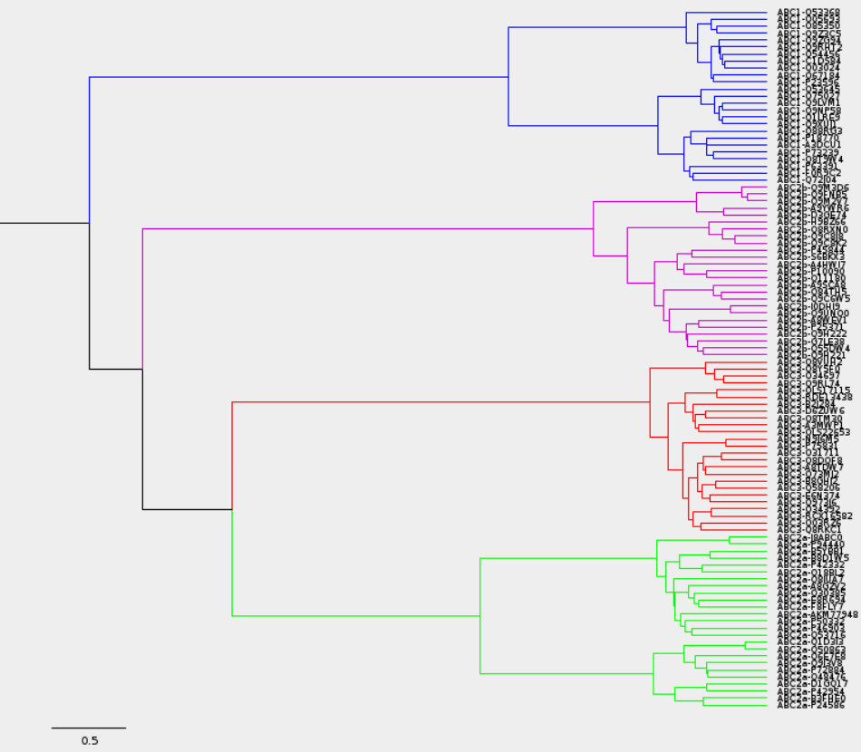

```{r setup, include=FALSE}
knitr::opts_chunk$set(fig.width=6, fig.height=4)
```

## Introduction 

Protein clustering is a fundamental step in the analysis of protein sequences. It allows to group proteins with similar functions, structures, or evolutionary relationships. In this project, we will perform a protein clustering analysis using a dataset of protein sequences from the ABC transporter family.

The ABC transporter family is a group of proteins that are involved in the transport of various molecules across the cell membrane. These proteins are found in all living organisms and play a crucial role in many biological processes. The ABC transporter family is divided into several subfamilies, each with specific functions and characteristics. The main problematic of this project is to cluster the proteins of the ABC transporter family into groups based on their sequence similarity.


## Main Part

### BlastP Alignment

The first step in protein clustering analysis is to perform an all-against-all protein sequence alignment to obtain the bit score with BlastP. We did this using the local server _chaac_ of the Bachelor of Genomic Sciences of the UNAM. 

```{bash blast, eval=FALSE}
# Create BLAST database
makeblastdb -in ABC.faa -dbtype prot -out ABC_blastdb

# Execute BlastP
blastp -query ABC.faa -db ABC_blastdb -outfmt 7 -max_hsps 1 -use_sw_tback -out ABC.blastp

```

### Data formatting

The output of the BlastP alignment was processed to obtain a matrix of dissimilarity with the bit scores gotten from BLAST. This matrix was used to perform a hierarchical clustering analysis of the proteins.

```{r clustering, message=FALSE, warning=FALSE}
# Import libraries
library(cluster)
suppressPackageStartupMessages(library(tidyverse))
suppressPackageStartupMessages(library(factoextra))
suppressPackageStartupMessages(library(dendextend))
suppressPackageStartupMessages(library(ape))
suppressPackageStartupMessages(library(corrplot))
```


```{r clus}
# Read the data
data <- read.table("data/ABC.blastp", sep = "\t", header = FALSE, comment.char = "#")

# Assign names to the columns
colnames(data) <- c("query", 
                    "subject", 
                    "identity", 
                    "alignment_length", 
                    "mismatches", 
                    "gap_opens", 
                    "q_start", 
                    "q_end", 
                    "s_start", 
                    "s_end", 
                    "evalue", 
                    "bit_score")

```


```{r }
# Calculate the normalized similarity
similarity <- select(data, query, subject, bit_score)
similarity <- mutate(similarity, normalized_bit_score = bit_score / max(data$bit_score))

# Regularize diagonal in matrix
for(row in 1:nrow(similarity)) {
  if(similarity[row, "query"] == similarity[row, "subject"]) {
    similarity[row, "normalized_bit_score"] <- 1
  }
}
```


```{r }
# Calculate dissimilarity
dissimilarity <- mutate(similarity, dissimilarity = 1 - normalized_bit_score)

# Create a dissimilarity matrix
dissimilarity_matrix <- dissimilarity %>%
  select(query, subject, dissimilarity) %>%
  spread(key = subject, value = dissimilarity) %>%
  column_to_rownames(var = "query")
```

### Best number of clusters

We have learned that the determining an optimal number of clusters isn't trivial, we use different methods and plots in order to deciding the best number of clusters fitting our data. We will use the Elbow Method and the Silhouette Method to determine the optimal number of clusters.

```{r }

fviz_nbclust(dissimilarity_matrix, FUN = hcut, hc_method = "single", method = "wss", k.max = 10) +
  labs(subtitle = "The Elbow Method")

fviz_nbclust(dissimilarity_matrix, FUN = hcut, hc_method = "single", method = "silhouette", k.max = 10) +
  labs(subtitle = "The Silhouette Method")

fviz_nbclust(dissimilarity_matrix, FUN = hcut, hc_method = "average", method = "wss", k.max = 10) +
  labs(subtitle = "The Elbow Method")

fviz_nbclust(dissimilarity_matrix, FUN = hcut, hc_method = "average", method = "silhouette", k.max = 10) +
  labs(subtitle = "The Silhouette Method")

fviz_nbclust(dissimilarity_matrix, FUN = hcut, hc_method = "complete", method = "wss", k.max = 10) +
  labs(subtitle = "The Elbow Method")

fviz_nbclust(dissimilarity_matrix, FUN = hcut, hc_method = "complete", method = "silhouette", k.max = 10) +
  labs(subtitle = "The Silhouette Method")

fviz_nbclust(dissimilarity_matrix, FUN = hcut, hc_method = "ward.D", method = "wss", k.max = 10) +
  labs(subtitle = "The Elbow Method")

fviz_nbclust(dissimilarity_matrix, FUN = hcut, hc_method = "ward.D", method = "silhouette", k.max = 10) +
  labs(subtitle = "The Silhouette Method")
```

```{r}
dist_dissimilarity_matrix <- dist(dissimilarity_matrix)

# Cluster by hierarchical method
csin <- hclust(dist_dissimilarity_matrix, method = "single")

plot(csin, hang = -1, main = "Hierarchical Dendogram", cex=0.4)

#cut the dendogram such that 4 clusters are produced
rect.hclust(csin, k=4, border=2:4)
```


```{r}
#get the data points within each cluster
cls3 <- cutree(csin, k=4)  

#Scatter plot to visualize the data points in each cluster
#plot(dist_dissimilarity_matrix, xlim=c(0,8), ylim=c(0,8), col=cls3)
fviz_cluster(list(data = dist_dissimilarity_matrix, cluster = cls3))
```


Using several methods, we can see that the optimal number of clusters is 4 more repeatedly. Both single method results supports 5 clusters, but the other 6 methods finds an optimum in 4 clusters. Nevertheless, in the cluster plot it looks more obvious that 5 clusters are the best option, same as the dendogram. Because we know somethings about the nature of the data, we will use 4 clusters for the next steps.


### Comparing different hierarchical clustering methods

```{r}
# compare with method complete linkage

ccom <- hclust(dist_dissimilarity_matrix, method = "complete")
plot (ccom, hang = -1)
rect.hclust(ccom, k=4, border=2:4)

dend1 <- as.dendrogram (csin)
dend2 <- as.dendrogram(ccom)


#Now compare with method average and Ward.

cave <- hclust(dist_dissimilarity_matrix, method = "average")
plot (cave, hang = -1)
rect.hclust(cave, k=4, border=2:4)

dend3 <- as.dendrogram(cave)


cward <- hclust(dist_dissimilarity_matrix, method = "ward.D2")
plot (cward, hang = -1)
rect.hclust(cward, k=4, border=2:4)

dend4 <- as.dendrogram(cward)
```
From a first sight, we can see that the ward method may be the best option, as it has the lower inner distances within each clusters, and the higher distances between clusters, representing a better separation of the clusters and a better classification. 

```{r}  
trees_names <- c("csin", "ccom", "cave", "cward")
trees <- list(csin, ccom, cave, cward)
for (i in seq_along(trees)) {
  my_tree <- as.phylo(trees[[i]])  # Convertir hclust a phylo
  write.tree(phy = my_tree, file = paste0(trees_names[i], ".tree"))  # Nombre correcto
             #Save single tree in Newick format
}
```

```
figtree csin.tree
figtree ccom.tree
figtree cave.tree
figtree cward.tree
```

Through the visualization of the trees with FigTree, we can see that in general all the methods cluster the data in a carrect way, knowing that each proteins ID has marker of its group. Only the single method has a cluster that is not well defined, it splited the ABC2a group in two, it didn't do the best clustering.







### Comparing different hierarchical clustering methods

```{r}
trees = dendlist("sing"=dend1, "com"=dend2, "ave"=dend3, "ward"=dend4)
baker = cor.dendlist(trees,method="baker")

corrplot(baker,
         method="circle",
         type="lower",
         tl.col = "black",
         tl.cex = 1.0,
         cl.cex = 1.0,
         addCoef.col = "white",
         number.cex = 1.0,
         col.lim=c(0.0,1),
         col=COL2("RdBu",n = 20)
)
```

The correlation plot shows that the ward method shares a perfect correlation with average method, additionally, it has a great correlation with the single method. Intuitively, average and single methods has a great correlation too.

Because of this we'll explore the comparison of the dendograms of this 3 pairs of methods. It showed what expected, the entaglement value is congruent with the correlation plot, the ward and average methods are the most similar, and both, ward and average methods have a good correlation with the single method.

```{r}
tanglegram(dend1, dend3, main = paste("Entanglement =", entanglement(dendlist(dend1, dend3))))

tanglegram(dend1, dend4, main = paste("Entanglement =", entanglement(dendlist(dend1, dend4))))

tanglegram(dend3, dend4, main = paste("Entanglement =", entanglement(dendlist(dend3, dend4))))
```


### Tree Agglomerative Coefficient

At last, we will use the agnes function to perform the hierarchical clustering analysis using the different methods and compare the agglomerative coefficient of each method. We see that ward method is the best options for this data, as it has the highest cophenetic correlation coefficient, of 0.9181161.

```{r}
hc_sin <- agnes(dist_dissimilarity_matrix, method = "single")
hc_sin$ac

hc_com <- agnes(dist_dissimilarity_matrix, method = "complete")
hc_com$ac

hc_ave <- agnes(dist_dissimilarity_matrix, method = "average")
hc_ave$ac

hc_ward <- agnes(dist_dissimilarity_matrix, method = "ward")
hc_ward$ac
```


## Conclusion

In conclusion, we have performed a protein clustering analysis using a dataset of protein sequences from the ABC transporter family. We have obtained a dendogram with 4 clusters using the hierarchical clustering method. We have also compared different hierarchical clustering methods, and through several comparison values and agglomerative coefficient, we found that the ward method is the best option from 4 different clustering methods (single, complete, average and ward) for this data. 

Additionally, through this project, we have learned the importance of clustering, due to it is a powerful strategy to solve a problem as ancient  and human characteristic as the classification of things. Clustering propose a way to study study objects, that many time its classification nor its properties are clear, so common in biology problematic.  

We learnt how to perform a protein clustering analysis using R and the different methods and plots that can be used to determine the optimal number of clusters and compare different hierarchical clustering methods.


